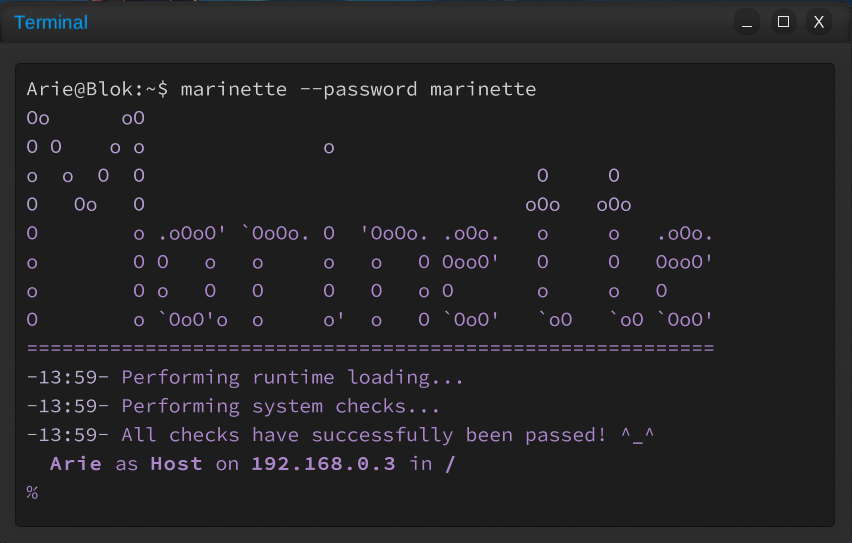
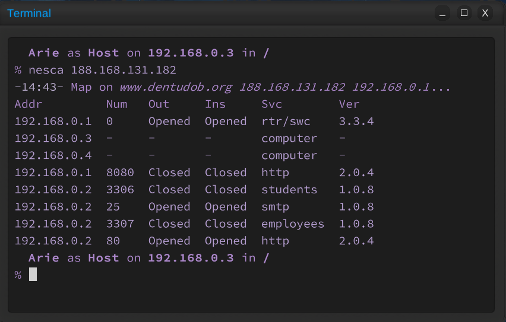
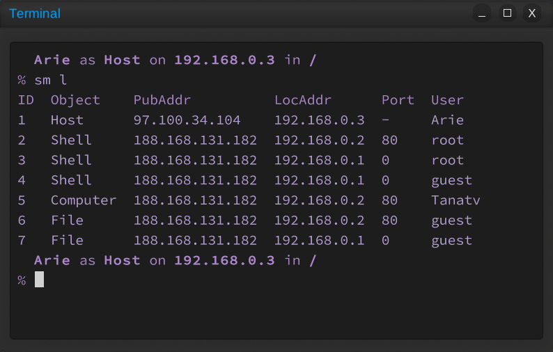

# Marinette

Cute, simple and open source shell

Important note: this is **NOT A REAL HACKING TOOLKIT**! This has been made, works and will work only in the game called Grey Hack!

Currently, I consider Marinette an MVP, yet it is already capable of doing some basic stuff

This repository is the only place where you can get Marinette without any risks. Do NOT trust in-game websites!!!

## Table of contents

1.  [Description](#description)
2.  [How to install?](#installation-guide)
    2.1.    [Unreliable, fast way](#unreliable-install)
    2.2.    [Reliable, slow way](#reliable-install)
3.  [How to contribute?](#contribution)
4.  [Frequently Asked Questions](#faq)
5.  [Similar projects](#similar-projects)
6.  [License](#license)
7.  [Thanks and Credits](#thanks-and-credits)

## Description 

Marinette is a [Shell](https://en.wikipedia.org/wiki/Shell_(computing)) without any fancy features like [Shell Expansions](https://www.gnu.org/software/bash/manual/html_node/Shell-Expansions.html), [Shell Scripting](https://en.wikipedia.org/wiki/Shell_script), [Pipelines](https://en.wikipedia.org/wiki/Pipeline_(Unix)) and so on. I have tried to make it as simple as I could, using few to no abstractions, allowing both the end users and myself to change it programmatically if needed. And I wouldn't say I've succeeded. =D

If you are a newbie then PLEASE DON'T USE MARINETTE OR ANY OTHER PREMADE HACKING TOOL! Hack by hand first, get a grip on the game mechanics, try to code something by yourself and have fun in general!

## How to install? 

There are two ways to install Marinette: Unreliable and reliable

Unreliable is unreliable because you are not:
1.  Dynamically creating a script for making the in-game folder structure. I can easily forget to update it when doing yet another commit
2.  Changing the password of the executable, since it is sha256() 25 times and can be changed only with a script
3.  Randomly generating the identificator which may result in identificator collision with another Marinette user

Reliable way frees yourself from these problems

### Unreliable, fast way 

1.  Copy [marinette_installer.src](scripts/marinette_installer.src) into the game directory. It will create the project structure at neccessary for successfull compilation
2.  Copy-Paste every source file from [src](src) into the in-game **/home/guest/Sources/Marinette/src**
3.  (Optionally) Change the stuff in **marilib.src**
    1.    Change the **Constants.identificator** to some 32 characters long string
    2.    Scroll down to **Theme** and change it as you want
4.  Compile **marinette.src**. Launch marinette with `--password marinette` parameters. Congratulations!

### Reliable, (kinda?)slow way 

1.  Download the repository to your computer
2.  From the root of the project, launch **scripts/marinette_installer.py**. It will create **marinette_installer.src**
3.  Repeat steps 1-2 from [Unreliable way](#unreliable-install)
4.  (Optionally) Change the stuff in **marilib.src**
    1.    From the root of the project, launch **scripts/hash_password.py** with the desired password. You will get a hashed password you can set in **Constants.password**
    2.    From the root of the project, launch **scripts/identifying_signal.py**. You will get random identificator you can set in **Constants.identificator**
    3.    Scroll down to **Theme** and change it as you want
5.  Compile **marinette.src**. Launch marinette with `--password YOUR_PASSWORD_HERE` parameters. Congratulations!

## How to contribute? 

If you want to contibute, then look at the code first. Still want to contribute? Okie, great! Open pull request and wait for me to accept it!

## Frequently Asked Questions 

Q: Why on earth would you call a computer program with a human name?

A: Because everything made with love should be named as a human being

Q: Why would you create yet another shell when there are already dozens of them?

A: Because all shells lack something that I want and I have wanted something made by myself

Q: When will you finally update?

A: When I have time and will to do that =D

Q: Why the code quality is so bad?

A: I don't know. Maybe because I am insane and stupid? =D

Q: Why you left every address unchanged on the screenshots?

A: Because I reset every so often and target has been randomly generated with `raddr` command anyway

Q: Will you do user manual?

A: Maybe in the future

## Similar projects 

Another cute shell projects:

-   [5hell](https://github.com/jhook777/5hell-for-Grey-Hack-the-Game) by Plu70. Keep in mind the github updates less frequently than the in-game site, so look for most up-to-date version in the game(As of 31 Jan 2024 the official in-game website is www.5hell.org)
-   [SeaShell](https://github.com/Tuna-Terps/SeaShell-greyhack-game) by Tuna Terps
-   [rocShell](https://github.com/rocketorbit/rocShell) by rocketorbit
-   [Lunar](https://github.com/cloverrfoxx/greyhack) by Clover if you are experienced enough to remove backdoor functionality, [Unclovered Lunarium](https://github.com/h4cktoria/unclovered-lunarium) by myself if you are not
-   [Project Pollux](https://github.com/SidiaDevelopment/greyhack-console) by Sidia
-   [Project p1an0Xshell](https://github.com/wh0wfg/greyscripts-p1an0) by Irtalhmu
-   [Project Vexxed](https://github.com/WizeWizard42/GreyHack-Vexxed) by WizeWizard
-   [OpenViper](https://github.com/cantemizyurek/viper-3.0) by viris(maybe? not entirely sure)
-   [MTX Franework](https://github.com/tuonux/mtx) by tuonux. Not a shell, just an interesting project that I've decided to include anyway

If you want me to add your shell, then open an issue and I will add you as fast as I can! However, do keep in mind that I DON'T endorse proprietary projects as they are potentially malicious to the end user, and therefore won't add something like Viper/Omni/RedFox/etc

## License 

This software is licensed under Zero-Clause BSD. See [here](LICENSE) for full details

## Thanks and Credits 

Special thanks and credits goes to:

-   [Kurouzu](https://steamcommunity.com/profiles/76561198135838638) - for [Grey Hack](https://store.steampowered.com/app/605230/Grey_Hack/)
-   [Joe Strout](https://github.com/JoeStrout) - for [MiniScript](https://github.com/JoeStrout/miniscript)
-   [Clover](https://github.com/cloverrfoxx) - for [Lunar](https://github.com/cloverrfoxx/greyhack), from where I have taken and adapted a lot of design choices
-   [Roupi](https://www.greyrepo.xyz/users/roupi) - for [Scan class module](https://www.greyrepo.xyz/posts/scan-class)
-   [Finko42](https://github.com/Finko42) - for [Encryption and Hashing algorithms](https://github.com/Finko42/GreyHack)
-   Ariavne - for allowing me to use their nickname as a command name(`ariadne`)

If I have somehow forgotten to mention you in here then accept my apologizes! Open an issue and I will add you as fast as I can!
